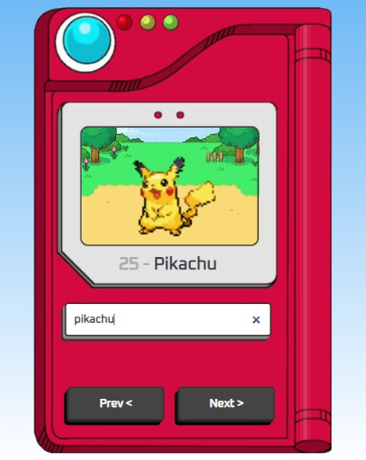

**Project**

Pokédex

**Description**
Welcome to the world of Pokémon! Explore the vast collection of Pokémon creatures through our Pokédex.

**Resources**

The "Pokemon Pokedex" is a responsive, front-end web application designed to showcase and provide information about various Pokémon creatures from the popular Pokémon franchise. It offers a visually engaging user interface where visitors can search for and explore Pokémon profiles, images and names. The page also features navigation buttons for easy access to individual Pokémon profiles.

.HTML5
.CSS
.Vanilla Javascript
.Responsive Design - Desktop/Tablet/Mobile
.Pokémon API

**Github Page**

Clique no link abaixo para visitar a página.

https://brunocarletti182.github.io/pokedex/

**Imagens do projeto**

